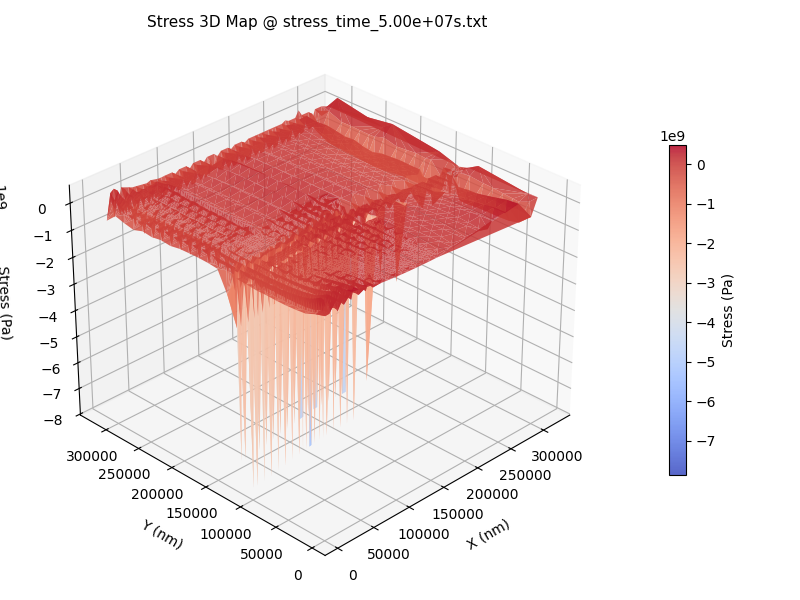
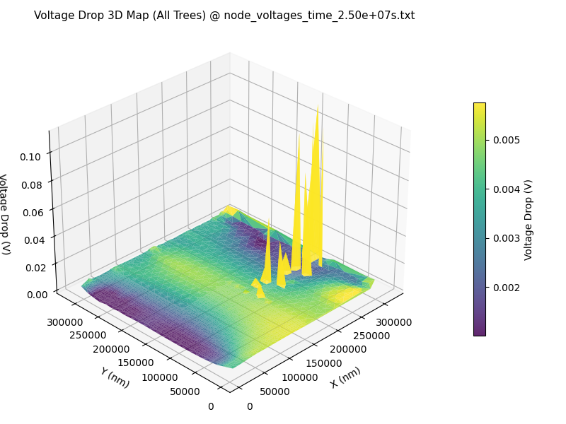
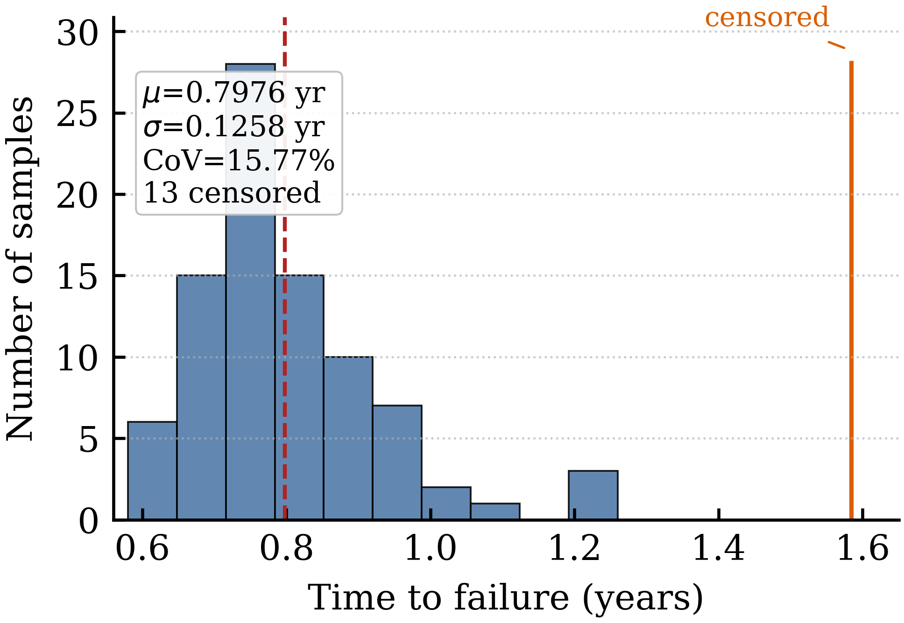

# MetalStack

**Know where your chip's power grid will fail, and when — across the full chip, fast enough
to run on every iteration.**

MetalStack analyzes electromigration, thermomigration, and IR-drop together, using the real heat
and current your chip will see rather than the conservative rules most flows still rely on.
It works on power grids taken straight from OpenROAD or Synopsys ICC / Fusion Compiler.

MetalStack ships **two engines over one physics**:

| Engine | Kind | Use it for |
|---|---|---|
| **MetalStack Core** | Physics-exact | Sign-off, lifetime guarantees, reliability reports |
| **MetalStack-AI (PINN)** | AI-accelerated | Design exploration, what-if sweeps, automated design loops — up to 86× faster, within 0.05% of Core |

The AI engine doesn't replace the exact one — it's measured against it. Both solve the same
physics, so every fast answer comes with a known margin, and anything important can be re-run
the exact way to confirm.

> 🌐 Please visit the [MetalStack site](https://sheldonucr.github.io/metalstack_io/) for more information

  
  
  

RISC-V core: where the damage forms (18 nets at risk) · voltage drop after aging · lifetime across 100 runs.

---

## Highlights

- **One coupled analysis** — electromigration, thermomigration, and IR-drop solved together,
  because on real silicon they are one connected problem.
- **Your chip's real heat map** — feed MetalStack measured or simulated temperature profiles instead
  of assuming a uniform die. Where the hotspots sit matters more than the average.
- **Self-heating, captured** — wires heat themselves as current flows through them, and MetalStack
  finds those local peaks instead of averaging them away.
- **Aging that feeds back** — as wires degrade, the analysis updates itself, so you see how the
  grid behaves years into the product's life rather than only on day one.
- **Lifetime with odds attached** — results come back as a range with real probabilities, not a
  single pessimistic number you have to guess a margin around.
- **Fits your existing flow** — works on power grids from OpenROAD or Synopsys ICC / Fusion
  Compiler, with no new methodology to adopt.
- **Scriptable end to end** — every input and output is exposed, so MetalStack drops into automated
  and AI-driven design flows without a human in the middle.
- **Fast, exactly** — built-in acceleration returns results 1.18×–1.50× faster with **identical**
  lifetime and IR-drop numbers.
- **Faster still, with AI** — MetalStack-AI runs the same analysis **up to 86× faster** than the
  exact engine and **up to 243× faster** than commercial tools, staying within **0.05%** of the
  exact answer.

---

## How it works

1. **Hand it your design** — the power grid from your existing layout, plus a heat map if you
   have one.
2. **It skips what can't fail** — a fast first pass sets aside the nets that will never break,
   so the real compute goes where the risk is.
3. **It ages your chip** — MetalStack runs your grid forward through its service life, tracking how
   heat, current, and wear compound on each other.
4. **You get the failure picture** — where damage forms, how far voltage drop has drifted, and
   the date your design crosses the limit you set.

Switch on MetalStack-AI and step 3 runs in seconds instead of hours — same inputs, same outputs,
no change to how you work.

---

## Results at a glance

### Six industrial-scale designs

Real power grids pulled from Synopsys Fusion Compiler at 32/28 nm.

| Design | Size | Voltage drop, new | Voltage drop, aged | Lifetime | Analysis time |
|---|---:|---:|---:|---|---:|
| AES engine     | 97 nets  | 6.1% | 6.9%  | passes     | 3.8 s  |
| ARM pad ring   | 68 nets  | 0.3% | 0.3%  | passes     | 2.0 s  |
| JPEG codec     | 178 nets | 6.6% | 6.8%  | passes     | 12.9 s |
| Dual RAM       | 55 nets  | 0.1% | 0.1%  | passes     | 1.6 s  |
| RISC-V core    | 186 nets | 6.2% | 29.6% | 9.4 months | 4.5 s  |
| ARM logic core | 208 nets | 8.9% | 22.2% | 4.0 months | 31.5 s |

The RISC-V core looks healthy at 6.2% voltage drop on day one, then degrades to 29.6% — and only
18 of its 186 nets are responsible. A handful of overloaded wires can take down a grid that
passes every check you'd run today.

### AI acceleration — MetalStack-AI

Time to complete a full variation-aware reliability analysis, small structures to large:

| Structure size | Commercial tool | MetalStack | MetalStack-AI | Speedup | Difference |
|---|---:|---:|---:|---:|---:|
| Small      | 22 min | 7.6 min  | 0.25 s | **86×** | 0.02% |
| Medium     | 37 min | 12.7 min | 0.43 s | **77×** | 0.03% |
| Large      | 50 min | 17.2 min | 0.39 s | **63×** | 0.03% |
| Very large | 60 min | 22.2 min | 0.61 s | **46×** | 0.04% |
| Largest    | 69 min | 25.4 min | 0.80 s | **36×** | 0.04% |

End to end, an analysis that takes a commercial tool 48 minutes takes MetalStack 17 minutes and
MetalStack-AI 20 seconds — a **145×** speedup. That is the difference between an analysis you
schedule overnight and one you run every time you change the design.

Four hundredths of a percent, worst case. For every decision you'd make from this analysis,
the fast answer and the exact answer are the same answer.

Method published as *BPINN-EM: Fast Stochastic Analysis of Electromigration Damage using
Bayesian Physics-Informed Neural Networks*, ICCAD 2024
([paper](https://sheldonucr.github.io/published_papers/iccad24_bpinn_stochastic_electromigration.pdf)).
The numerical baseline reported there as "EMSpice" is the MetalStack numerical engine.

### Average temperature hides the answer

Run the RISC-V core under two different heat patterns with the **same average and the same peak
temperature**, and you get opposite outcomes: one fails in 9.4 months, the other passes. The only
difference is where the hotspot lands relative to the current paths — which is exactly what
rule-based EM checks cannot see.

### How much does manufacturing spread matter?

It depends entirely on the design, which is why you have to measure it:

| Design | Lifetime spread |
|---|---:|
| RISC-V core       | **±16%** (7 to 15 months) |
| ARM Cortex-A core | **±0.006%** (same every time) |

Guessing a single margin would leave one design over-built and the other exposed.

---

## What you give it

| Input | Description |
|---|---|
| **Power grid** | Taken from your existing layout — Synopsys ICC / Fusion Compiler or OpenROAD. |
| **Settings** | Material and solver parameters in a simple YAML file. |
| **Heat map** *(optional)* | A measured or simulated temperature profile. Without one, MetalStack uses self-heating over an ambient baseline. |

## What you get back

- Where damage forms across the power grid, and how it spreads
- Temperature across the grid, including self-heating hotspots
- Voltage drop maps at any point in the design's life
- The date your design crosses the limit you set — as a single number or a range with odds
- Degraded netlists you can feed back into your flow

---

## Contact

MetalStack is a product of **Noveety AI, Inc.** For access, licensing, or a technical walkthrough,
contact [noveetyai@noveetymanagement.com](mailto:noveetyai@noveetymanagement.com).

---

© 2026 Noveety AI, Inc. All rights reserved.

